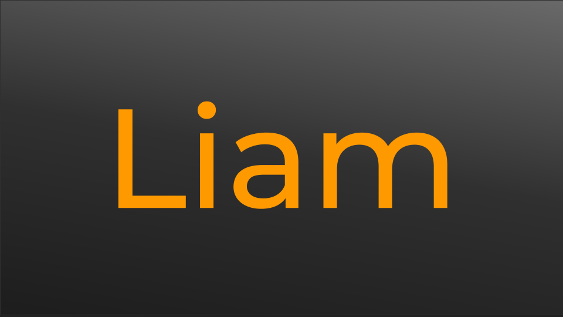

<p align="center">
    
    <br/>
   A Data-Oriented Programming Language for modern developers.
    <br/>
    <br/>
    <a href="https://github.com/jackdelahunt/Liam">
        
    </a>
    <a href="https://github.com/jackdelahunt/Liam">
        
    </a>
    <a href="https://github.com/jackdelahunt/Liam">
        
    </a>
    <a href="https://github.com/jackdelahunt/Liam">
        
    </a>
    <br>
</p>


# The Liam Programming Language
Liam is a strongly typed compiled language intended for performance comparable to C++ but less pain along the way. Liam generates and outputs `c++` which is then compiled to a final binary. 

```rust
import "stdlib/io";

struct Person[T] {
    name: ^char,
    data: T
}

fn main(): u64 {
    let p: Person[u64] = new Person[u64]{
        "liam",
        12
    };

    print[^char](p.name);
    print[u64](p.data);

    for let i := 0; i < p.data; i = i + 1; {
        print[u64](i);
    } 
}
```

## Documentation
#### [Learning the basics](docs/Learning-the-basics.md)
Some helpful documentation for getting started learning Liam.

#### [Installing and usage](docs/Installing.md)
Learn how to get the compiler on your machine and how to use it.

#### [Building](docs/Building.md)
Learn how to get the compiler on your machine and how to use it.
